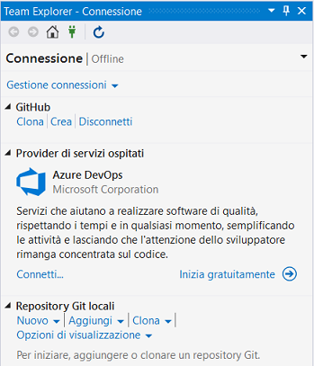
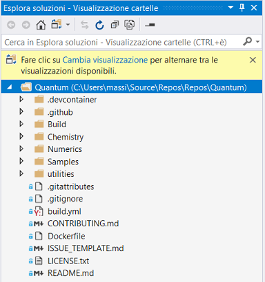
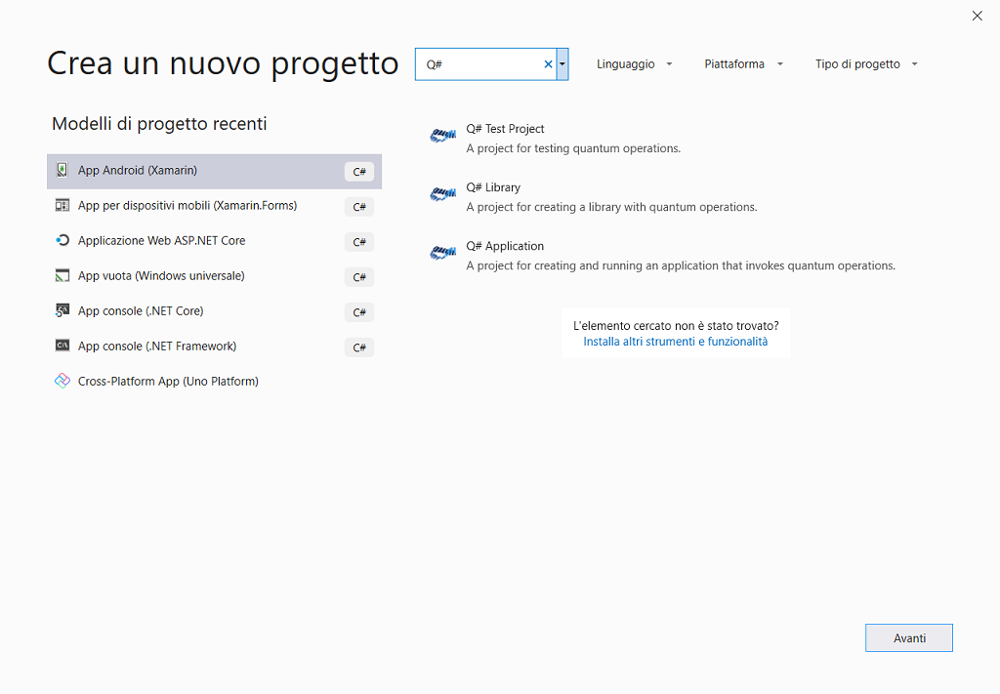
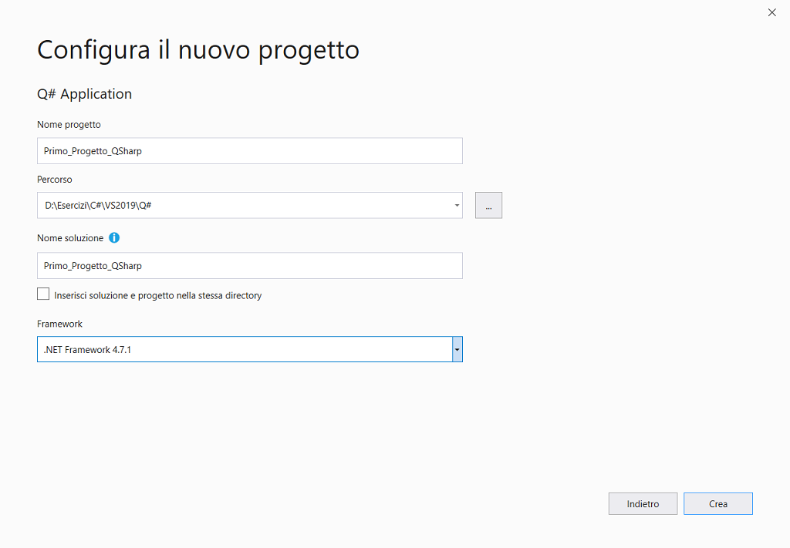
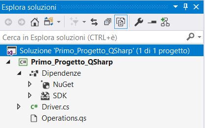
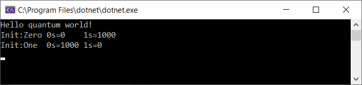
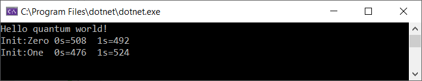
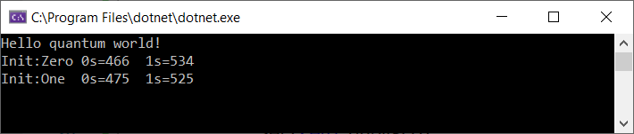
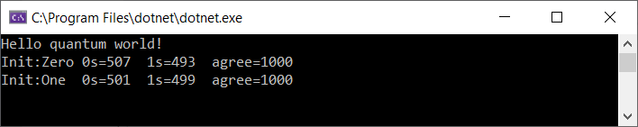

# Q#


## Introduzione

Il simulatore incluso con il Kit di sviluppo di Quantum richiede un’installazione a 64 bit di Windows e per l’esecuzione una CPU abilitata per **AVX** (*Advanced Vector eXtensions*).

[**QDK (*Quantum Development Kit*)**](**https://www.microsoft.com/en-us/quantum/**)

[Microsoft QDK](https://marketplace.visualstudio.com/items?itemName=quantum.DevKit/) 

| **Componente**                           | **Funzione**                                                 |
| ---------------------------------------- | ------------------------------------------------------------ |
| Compilatore e   linguaggio Q #           | Q# è un linguaggio di programmazione specifico utilizzato   per esprimere algoritmi quantistici, è utilizzato per la scrittura di   programmi che si eseguono su un processore quantistico. |
| Q # libreria standard                    | La libreria contiene operazioni e funzioni che supportano   sia l’esigenza di controllo del linguaggio non-Q# sia gli algoritmi di   quantum Q#. |
| Simulatore locale                        | Un simulatore completo ottimizzato per la velocità e la   simulazione accurata vettoriale. |
| Simulatore di traccia del PC quantistico | È utilizzato per stimare le risorse necessarie per   eseguire un quantum programma e consente, inoltre, di velocizzare il debug   del non-Q# codice di controllo. |


[Help](https://docs.microsoft.com/it-it/quantum/?view=qsharp-preview/)

#### Clonare il repository di GitHub Quantum

Aprire Visual Studio, aprire la finestra ***Team Explorer – Home page***.



 

Selezionare ***Clona*** sotto ***Repository Git locali*** e immettere il seguente [indirizzo](https://github.com/Microsoft/Quantum.git/ ).

 Sarà clonato il repository in locale C:\USERS\MASSI\SOURCE\REPOS\QUANTUM e Visual Studio passa a ***Esplora soluzioni*** popolata con le librerie e i campioni.




## Creare un progetto

 Per prima cosa, si creerà un progetto Q#. Il tipo di progetto include fin dall'inizio tutti i file modello necessari.

1. Aprire Visual Studio 2019.
2. Nella finestra iniziale scegliere ***Crea un nuovo progetto***.
3. Nella finestra ***Crea un nuovo progetto*** immettere o digitare *Q#* nella casella di ricerca. 

Dopo aver applicato i filtri di linguaggio e piattaforma, scegliere il modello ***Q# Application* ** e quindi scegliere ***Avanti***.



4. Nella finestra ***Configura il nuovo progetto*** digitare o immettere *Primo_Progetto_QSharp* nella casella ***Nome del progetto***. Scegliere ***Crea***.



Visual Studio aprirà il nuovo progetto che include il codice predefinito.


## Creare l'app

A questo punto è possibile iniziare a sviluppare l'app. 



File DRIVER.CS

```csharp
// driver di C# per il codice di quantum
using Microsoft.Quantum.Simulation.Core;
using Microsoft.Quantum.Simulation.Simulators;
using static System.Console;

namespace Quantum.Primo_Progetto_QSharp
{
    internal class Driver
    {
        private static void Main()
        {
            using (var qsim = new QuantumSimulator())
            {
                Clear();
                HelloQ.Run(qsim).Wait();
                // prova i valori iniziali
                Result[] initials = new Result[] { Result.Zero, Result.One };
                foreach (Result initial in initials)
                {
                    var res = BellTest.Run(qsim, 1000, initial).Result;
                    var (numZeros, numOnes) = res;
                    WriteLine($"Init:{initial,-4} 0s={numZeros,-4} 1s={numOnes,-4}");
                }
            }
            ReadKey();
        }
    }
}
```

Nell’esempio, il simulatore *sim* calcola tutti i parametri necessari per l’algoritmo quantistico, è fissato a *1000* ed è il valore iniziale del qubit *initial*.

Ogni operazione di Q# genera una classe C# con lo stesso nome, questa classe ha un metodo che in modo asincrono esegue l’operazione.

 **L’esecuzione è asincrona perché sull’H/W effettivo sarà asincrono.**

 Il risultato dell’operazione è una tupla di *numZeros* e di *numOnes* misurato dal simulatore che è restituita in C# come due campi da stampare.


File OPERATION.QS

Questo codice definisce una Q# operazione: è l’unità base di esecuzione quantistica, equivale ad una funzione in C o C++ e ad un metodo statico in C# o Java.

I parametri per un’operazione sono specificati come una tupla, all’interno delle ().

Il tipo restituito dell’operazione è specificato dopo i (:), nell’esempio, l’operazione non ha ritorno, quindi è contrassegnato come una tupla vuota di ritorno, equivale a *void* in C.

Un’operazione ha un corpo che contiene l’implementazione dell’operazione.

Nell’esempio, l’operazione imposta un qubit in uno stato noto, si misura il qubit, se è nello stato che si desidera, lo si lascia altrimenti si modifica.

```csharp
namespace Quantum.Primo_Progetto_QSharp
{
    open Microsoft.Quantum.Intrinsic;
    open Microsoft.Quantum.Canon;
	
	operation HelloQ () : Unit {
        Message("Hello quantum world!");
    }

    operation Set (desired: Result, q1: Qubit) : Unit  {
            let current = M(q1);
            if (desired != current)
            {
                X(q1);
            }
    }

	operation BellTest (count : Int, initial: Result) : (Int,Int) {   
            mutable numOnes = 0;
            using (qubits = Qubit[1])
            {   for (test in 1..count) {
                    Set (initial, qubits[0]);
                    let res = M (qubits[0]);
                    // contare il numero di quelli che abbiamo visto
                    if (res == One) {
                        set numOnes = numOnes + 1;
                    }
                }
                Set(Zero, qubits[0]);
            }
            // ritorno numero di volte che abbiamo visto un | 0 > e il numero di volte che abbiamo visto un | 1 >
            return (count-numOnes, numOnes);
        }
}
```

Metodo `operation BellTest` 

Imposta un valore specificato in un qubit e misura il risultato, l’iterazione si occupa di raccogliere statistiche su quanti zeri e restituirli al chiamante.

Esegue anche un’altra operazione necessaria, reimposta il qubit prima di restituirlo permettendo ad altri di allocare questo qubit in uno stato noto.

Tutte queste chiamate utilizzano operazioni quantistiche primitive che sono definite nel *namespace*.

Q# utilizza una sintassi C#-like.

Q# tratta le variabili in un modo unico, per impostazione predefinita, le variabili in Q# sono immutabili, il loro valore non può essere modificato.

La parola chiave *mutable* è utilizzata per indicare l’associazione di una variabile modificabile.

In entrambi i casi, il tipo di una variabile è dedotto dal compilatore: linguaggio “**dinamicamente tipato”** o **dinamico**.

Un’istruzione alloca un set di qubit all’inizio e rilascia i qubit alla fine del blocco.


## Esecuzione dell'app

 A questo punto è possibile compilare, distribuire e avviare l'app per verificarne l'aspetto. 


 **Manipolazione del qubit**

In primo luogo si cerca solo di capovolgerlo, basta eseguire la seguente istruzione.

```csharp
operation BellTest (count : Int, initial: Result) : (Int,Int) {   
            mutable numOnes = 0;
            using (qubits = Qubit[1])
            {   for (test in 1..count) {
                    Set (initial, qubits[0]);
					X(qubits[0]);
					let res = M (qubits[0]);
                    // contare il numero di quelli che abbiamo visto
                    if (res == One) {
                        set numOnes = numOnes + 1;
                    }
                }
                Set(Zero, qubits[0]);
            }
            // ritorno numero di volte che abbiamo visto un | 0 > e il numero di volte che abbiamo visto un | 1 >
            return (count-numOnes, numOnes);
        }
```

 Adesso i risultati sono invertiti.



Tutto quello che si deve fare è sostituire il gate nell’esecuzione precedente con un **Hadamard** gate.

 *Jacques Solomon Hadamard (Versailles, 8 dicembre 1865 – Parigi, 17 ottobre 1963).*

La trasformazione Hadamard chiamata Hadamard Gate è una rotazione qubit.

```csharp
operation BellTest (count : Int, initial: Result) : (Int,Int) {   
            mutable numOnes = 0;
            using (qubits = Qubit[1])
            {   for (test in 1..count) {
                    Set (initial, qubits[0]);
					H(qubits[0]);
					let res = M (qubits[0]);
                    // contare il numero di quelli che abbiamo visto
                    if (res == One) {
                        set numOnes = numOnes + 1;
                    }
                }
                Set(Zero, qubits[0]);
            }
            // ritorno numero di volte che abbiamo visto un | 0 > e il numero di volte che abbiamo visto un | 1 >
            return (count-numOnes, numOnes);
        }
```

 Adesso i risultati sono i seguenti.

 

Ogni volta che si misura, il qubit è a metà strada tra 0 e 1, in questo modo si ottiene statisticamente 0 la metà del tempo e 1 metà del tempo.

Questo è la **sovrapposizione** e ci dà la prima vera e propria vista in uno stato quantico.

 **Entanglement**

Allocare 2 qubit invece di 1.

`using(qubits = Qubit[2])`

Questo permetterà di aggiungere un nuovo gate.

```csharp
Set (initial, qubits[0]);
Set (Zero, qubits[1]);
//X(qubits[0]);
H(qubits[0]);
CNOT(qubits[0],qubits[1]);
let res = M (qubits[0]);
```

Bisogna reimpostare il secondo qubit prima di rilasciarlo

```csharp
Set(Zero, qubits[0]);
Set(Zero, qubits[1]);
```

Metodo `operation BellTest` completo.

```csharp
	operation BellTest (count : Int, initial: Result) : (Int,Int) {   
	          mutable numOnes = 0;
			  //using (qubits = Qubit[1])
			  using (qubits = Qubit[2])
			  {   for (test in 1..count) {
			            Set (initial, qubits[0]);
						Set (Zero, qubits[1]);
						//X(qubits[0]);
						H(qubits[0]);
						CNOT(qubits[0],qubits[1]);
						let res = M (qubits[0]);
						// contare il numero di quelli che abbiamo visto
						if (res == One) {
						       set numOnes = numOnes + 1;
					    }
                   }
                  Set(Zero, qubits[0]);
	              Set(Zero, qubits[1]);
             }
             // ritorno numero di volte che abbiamo visto un | 0 > e il numero di volte che abbiamo visto un | 1 >
             return (count-numOnes, numOnes);
        }
```

Si ottiene esattamente lo stesso risultato di 50-50 di prima, tuttavia, ciò che interessa davvero è come la seconda qubit reagisce.

 


## Nuova versione dell'app

File DRIVER.CS

```csharp
// driver di C# per il codice di quantum
using Microsoft.Quantum.Simulation.Core;
using Microsoft.Quantum.Simulation.Simulators;
using static System.Console;

namespace Quantum.Primo_Progetto_QSharp
{
    internal class Driver
    {
        private static void Main()
        {
            using (var qsim = new QuantumSimulator())
            {
                Clear();
                HelloQ.Run(qsim).Wait();
                // prova i valori iniziali
                Result[] initials = new Result[] { Result.Zero, Result.One };
                foreach (Result initial in initials)
                {
                    var res = BellTest.Run(qsim, 1000, initial).Result;
                    var (numZeros, numOnes, agree) = res;
                    WriteLine($"Init:{initial,-4} 0s={numZeros,-4} 1s={numOnes,-4} agree={agree,-4}");
                }
            }
            ReadKey();
        }
    }
}
```

File OPERATION.QS

```csharp
namespace Quantum.Primo_Progetto_QSharp
{
    open Microsoft.Quantum.Intrinsic;
    open Microsoft.Quantum.Canon;
	
	operation HelloQ () : Unit {
           Message("Hello quantum world!");
    }

    operation Set (desired: Result, q1: Qubit) : Unit  {
            let current = M(q1);
            if (desired != current)
            {
                X(q1);
            }
    }

operation BellTest (count : Int, initial: Result) : (Int,Int,Int) {   
            mutable numOnes = 0;
            mutable agree = 0;
            using (qubits = Qubit[2])
            {   for (test in 1..count)   {
                    Set (initial, qubits[0]);
                    Set (Zero, qubits[1]);
                    H(qubits[0]);
                    CNOT(qubits[0],qubits[1]);
                    let res = M (qubits[0]);
                    if (M (qubits[1]) == res) {
                        set agree = agree + 1;
                    }
                    // contare il numero di quelli che abbiamo visto
                    if (res == One)  {
                        set numOnes = numOnes + 1;
                    }
                }
            Set(Zero, qubits[0]);
            Set(Zero, qubits[1]);
            }
            // ritorno numero di volte che abbiamo visto un | 0 > e il numero di volte che abbiamo visto un | 1 >
            return (count-numOnes, numOnes, agree);
        }
}
```

Ora c’è un nuovo valore restituito che terrà traccia ogni volta che la misura del primo qubit corrisponde alla misura del secondo qubit.

Eseguire l’app.

 